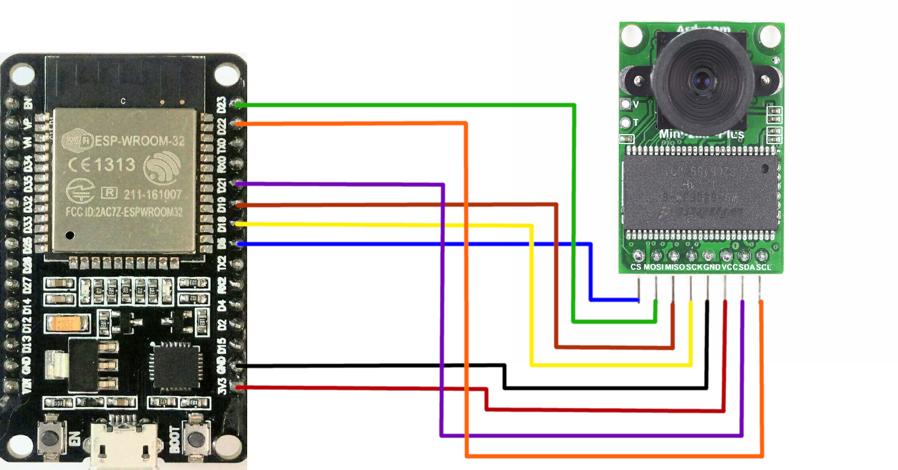

# ESPStream

### <ins>Hardware used</ins>
    - Android Phone
    - ESP-WROOM-32 Devkit 1
    - ArduCAM Mini 2MP Plus


#### <ins>ESP32 folder</ins>

Install ESP-IDF to the PC you will be using to flash the firmware to the ESP. [Getting Started with ESP32](https://docs.espressif.com/projects/esp-idf/en/latest/esp32/get-started/index.html)

###### Wiring Table & Diagram


|ArduCAM	| ESP32| 
|---------|------|
| CS	| GPIO 5|
| MOSI|	GPIO 23|
| MISO|	GPIO 19|
| SCK	| GPIO 18|
| GND	| GND|
| VCC	| 3V3|
| SDA	| GPIO 21|
| SCL	| GPIO 22|

###### To Build, flash and monitor

Launch ESP-IDF command promot or powershell linked from desktop or startmenu.

Change directory to ESP32 sub-directory, inside ESPStream folder, then execute:

`idf.py build flash monitor`

You should get output similar to this if it succeeded.
```
I (832) wifi: wifi connected!
I (842) wifi:AP's beacon interval = 102400 us, DTIM period = 1
I (3042) esp_netif_handlers: sta ip: 192.168.0.19, mask: 255.255.255.0, gw: 192.168.0.1
I (3042) wifi: got ip:192.168.0.19
I (3042) MAIN: Size of vsps: 8
I (3242) ArduCAM: SPI: interface OK: 55

I (3242) ArduCAM: I2C: OV2640 detected.

I (3242) ArduCAM: Initializing Camera...

I (34342) TCPIP: in tcp_server_init()

I (34342) TCPIP: TCP_SERVER ip: 192.168.0.19

I (34342) TCPIP: TCP_SERVER PORT: 89

I (34342) TCPIP: listening socket in INIT: 54

I (34342) TCPIP: In tcp_server_run()
I (34342) ArduCAM: In take_image()
```

If you are using a different ESP board you might have to change the SDKCONFIG file via:

`idf.py menuconfig`

Please check your board and set appropriate resources accordingly

#### <ins>ESPStream root folder</ins>

For information on setup for build enviorment please refer to:

https://github.com/cnlohr/rawdrawandroid/blob/master/README.md

Main project with test case ```ESPStream_test.c```, ESPStreams files are ```ESPStream.c``` and ```ESPStream.h```. there is also a bash script file for debugging that I added to help with this process happly named ```debug_ESPStream_test.sh``` if you feel inclined to do so.
  
There are a few hardcoded path's in the makefile that should be change to reflect your NDK file path to point to needed include files and libraries.
  
*need to fix this*
  
# TODO
  - Resolution control for camera's
  - Image capture input to write current image to storage
  - encryption for image trasmission.
  - multi-platform
  
# Current

This project in it's current state is a Proof of Concept for using a SPI interface ArduCam to work with ESP32 proto-type boards.

11/24/2022:

Switched from Arduino build to ESP-IDF build. 

Multi-threading is being used for camera function and network function.

Added C wrapper functions to arducam_esp component.

Fixed frequency issue with `interface_spi.c` set manually to 6Mhz.

Now getting upwards of 15 FPS.
